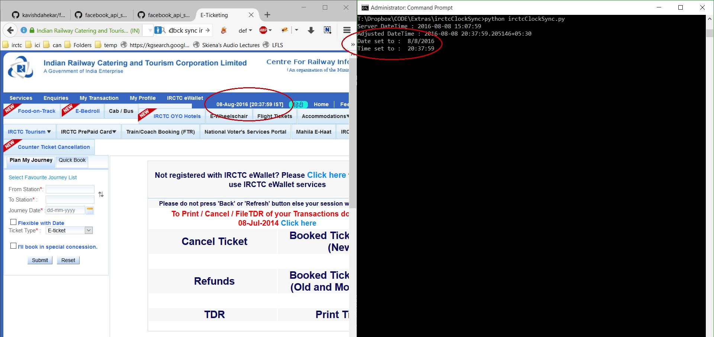

# irctcClockSync

IRCTC's tatkal bookings for AC and Sleeper classes start sharply at 10:00AM and 11:00AM IST respectively.

This script allows you to synchronize your system clock with the IRCTC's server clock as close as ±1 second so that you can be sure that you can try to start booking your ticket at the precise moment.

No manual configuration required.

**Usage :** (requires administrative priveleges)

    python irctcSyncClock.py

**Screenshot :**

